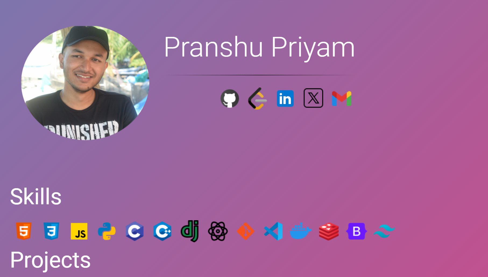

# My Portfolio site

To run the project locally, in the project directory, you can run:

### Using npm

Step 1:
`npm install`

Step 2:
 `npm start`

### Using Docker

Step 1:
`docker pull pranshup2903/portfolio-site-pranshu`

Step 2:
`docker run -d -p 3000:3000 pranshup2903/portfolio-site-pranshu:1.0`

This will run the project on port 3000 on your local machine

## Screenshots

<table style="width:50%;">
  <tr>
    <td style="text-align:center;">
      <h2 style="margin-bottom: 10px;">Home</h2>
      
    </td>
  </tr>
  <tr>
    <td style="text-align:center;">
      <h2 style="margin-bottom: 10px;">React Projects Section</h2>
      
    </td>
  </tr>
  <tr>
    <td style="text-align:center;">
      <h2 style="margin-bottom: 10px;">Django Projects Section</h2>
      
    </td>
  </tr>

  <tr>
    <td style="text-align:center;">
      <h2 style="margin-bottom: 10px;">Feedback Section</h2>
      
    </td>
  </tr>
</table>

## Technologies Used

  

